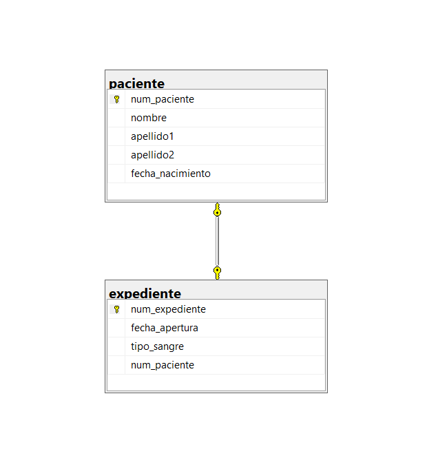

# Ejercicio 1: Paciente - Expediente

## Vinculos

- Base de datos (SQL): [03-Construccion-basededatos/DB/01_paciente_expediente.sql](../DB/01_paciente_expediente.sql)
- Modelo relacional (.drawio): [02-Modelado-basededatos/ER-a R/Relacional/1R_Paciente_Expediente(1).drawio](../../02-Modelado-basededatos/ER-a%20R/Relacional/1R_Paciente_Expediente(1).drawio)
- Imagen del modelo: [02-Modelado-basededatos/ER-a R/Relacional/1.png](../../02-Modelado-basededatos/ER-a%20R/Relacional/1.png)
- Diagrama SQL (imagen): [03-Construccion-basededatos/img_diagramas_BD/01-paciente_expediente.png](../img_diagramas_BD/01-paciente_expediente.png)

## Vista de diagramas (para no confundirse)

### 1) Modelo relacional (diseno)


### 2) Diagrama SQL (implementacion en tablas)



## Descripcion del ejercicio

Un hospital registra informacion de pacientes y de su expediente medico.

## Problematica

Se debe cumplir una relacion 1 a 1 obligatoria: cada paciente tiene exactamente un expediente y no puede existir expediente sin paciente.

## Codigo SQL

```sql
-- CREAR BASE DE DATOS
IF DB_ID('expedientes_medicos') IS NULL
BEGIN
    CREATE DATABASE expedientes_medicos;
END
GO

-- UTILIZAR LA BASE DE DATOS
USE expedientes_medicos;
GO

/*=========================== LIMPIAR TABLAS SI YA EXISTEN ==============================*/
IF OBJECT_ID('dbo.expediente', 'U') IS NOT NULL DROP TABLE dbo.expediente;
IF OBJECT_ID('dbo.paciente', 'U') IS NOT NULL DROP TABLE dbo.paciente;
GO

/*=========================== CREAR TABLA PACIENTE ==============================*/
CREATE TABLE dbo.paciente (
    num_paciente INT IDENTITY(1,1) NOT NULL,
    nombre VARCHAR(50) NOT NULL,
    apellido1 VARCHAR(50) NOT NULL,
    apellido2 VARCHAR(50) NULL,
    fecha_nacimiento DATE NOT NULL,
    CONSTRAINT pk_paciente PRIMARY KEY (num_paciente)
);
GO

/*=========================== CREAR TABLA EXPEDIENTE ==============================*/
CREATE TABLE dbo.expediente (
    num_expediente INT IDENTITY(1,1) NOT NULL,
    fecha_apertura DATE NOT NULL,
    tipo_sangre VARCHAR(5) NOT NULL,
    num_paciente INT NOT NULL,
    CONSTRAINT pk_expediente PRIMARY KEY (num_expediente),
    CONSTRAINT uq_expediente_num_paciente UNIQUE (num_paciente),
    CONSTRAINT fk_expediente_paciente FOREIGN KEY (num_paciente)
        REFERENCES dbo.paciente (num_paciente)
);
GO
```