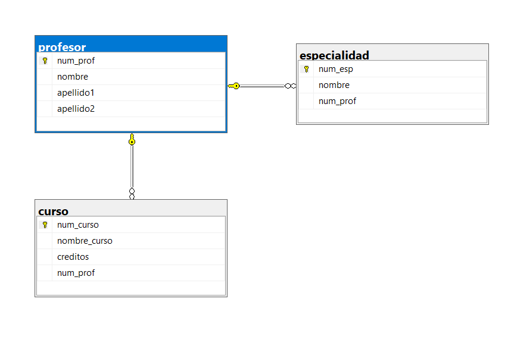

# Ejercicio 2: Profesor - Curso - Especialidad

## Vinculos

- Base de datos (SQL): [03-Construccion-basededatos/DB/02_profesor_curso_especialidad.sql](../DB/02_profesor_curso_especialidad.sql)
- Modelo relacional (.drawio): [02-Modelado-basededatos/ER-a R/Relacional/2R_Profesor_Curso_Especialidad.drawio](../../02-Modelado-basededatos/ER-a%20R/Relacional/2R_Profesor_Curso_Especialidad.drawio)
- Imagen del modelo: [02-Modelado-basededatos/ER-a R/Relacional/2.png](../../02-Modelado-basededatos/ER-a%20R/Relacional/2.png)
- Diagrama SQL (imagen): [03-Construccion-basededatos/img_diagramas_BD/02-profesor_curso_especialidad.png](../img_diagramas_BD/02-profesor_curso_especialidad.png)

## Vista de diagramas (para no confundirse)

### 1) Modelo relacional (diseno)


### 2) Diagrama SQL (implementacion en tablas)



## Descripcion del ejercicio

Una universidad administra profesores, cursos y especialidades.

## Problematica

Se requiere asignar cada curso a un profesor, permitiendo que un profesor imparta varios cursos y tenga una o mas especialidades.

## Codigo SQL

```sql
-- CREAR BASE DE DATOS
IF DB_ID('gestion_academica') IS NULL
BEGIN
    CREATE DATABASE gestion_academica;
END
GO

-- UTILIZAR LA BASE DE DATOS
USE gestion_academica;
GO

/*=========================== LIMPIAR TABLAS SI YA EXISTEN ==============================*/
IF OBJECT_ID('dbo.especialidad', 'U') IS NOT NULL DROP TABLE dbo.especialidad;
IF OBJECT_ID('dbo.curso', 'U') IS NOT NULL DROP TABLE dbo.curso;
IF OBJECT_ID('dbo.profesor', 'U') IS NOT NULL DROP TABLE dbo.profesor;
GO

/*=========================== CREAR TABLA PROFESOR ==============================*/
CREATE TABLE dbo.profesor (
    num_prof INT IDENTITY(1,1) NOT NULL,
    nombre VARCHAR(50) NOT NULL,
    apellido1 VARCHAR(50) NOT NULL,
    apellido2 VARCHAR(50) NULL,
    CONSTRAINT pk_profesor PRIMARY KEY (num_prof)
);
GO

/*=========================== CREAR TABLA CURSO ==============================*/
CREATE TABLE dbo.curso (
    num_curso INT IDENTITY(1,1) NOT NULL,
    nombre_curso VARCHAR(100) NOT NULL,
    creditos INT NOT NULL,
    num_prof INT NOT NULL,
    CONSTRAINT pk_curso PRIMARY KEY (num_curso),
    CONSTRAINT ck_curso_creditos CHECK (creditos > 0),
    CONSTRAINT fk_curso_profesor FOREIGN KEY (num_prof)
        REFERENCES dbo.profesor (num_prof)
);
GO

/*=========================== CREAR TABLA ESPECIALIDAD ==============================*/
CREATE TABLE dbo.especialidad (
    num_esp INT IDENTITY(1,1) NOT NULL,
    nombre VARCHAR(100) NOT NULL,
    num_prof INT NOT NULL,
    CONSTRAINT pk_especialidad PRIMARY KEY (num_esp),
    CONSTRAINT fk_especialidad_profesor FOREIGN KEY (num_prof)
        REFERENCES dbo.profesor (num_prof)
);
GO
```