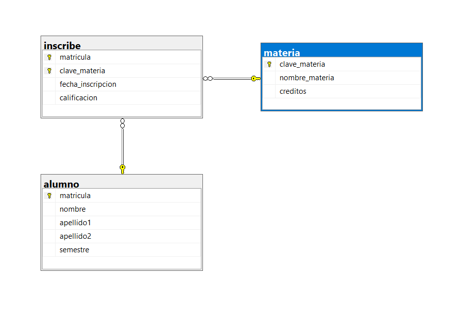

# Ejercicio 3: Alumno - Materia - Inscribe

## Vinculos

- Base de datos (SQL): [03-Construccion-basededatos/DB/03_alumno_materia_inscribe.sql](../DB/03_alumno_materia_inscribe.sql)
- Modelo relacional (.drawio): [02-Modelado-basededatos/ER-a R/Relacional/3R_Alumno_Materia_Inscribe.drawio](../../02-Modelado-basededatos/ER-a%20R/Relacional/3R_Alumno_Materia_Inscribe.drawio)
- Imagen del modelo: [02-Modelado-basededatos/ER-a R/Relacional/3.png](../../02-Modelado-basededatos/ER-a%20R/Relacional/3.png)
- Diagrama SQL (imagen): [03-Construccion-basededatos/img_diagramas_BD/03-alumno_materia_inscribe.png](../img_diagramas_BD/03-alumno_materia_inscribe.png)

## Vista de diagramas (para no confundirse)

### 1) Modelo relacional (diseno)


### 2) Diagrama SQL (implementacion en tablas)



## Descripcion del ejercicio

Una escuela administra alumnos, materias y sus inscripciones.

## Problematica

Se debe modelar una relacion muchos a muchos entre alumnos y materias, guardando atributos propios de la inscripcion como fecha y calificacion.

## Codigo SQL

```sql
-- CREAR BASE DE DATOS
IF DB_ID('control_inscripciones') IS NULL
BEGIN
    CREATE DATABASE control_inscripciones;
END
GO

-- UTILIZAR LA BASE DE DATOS
USE control_inscripciones;
GO

/*=========================== LIMPIAR TABLAS SI YA EXISTEN ==============================*/
IF OBJECT_ID('dbo.inscribe', 'U') IS NOT NULL DROP TABLE dbo.inscribe;
IF OBJECT_ID('dbo.materia', 'U') IS NOT NULL DROP TABLE dbo.materia;
IF OBJECT_ID('dbo.alumno', 'U') IS NOT NULL DROP TABLE dbo.alumno;
GO

/*=========================== CREAR TABLA ALUMNO ==============================*/
CREATE TABLE dbo.alumno (
    matricula VARCHAR(10) NOT NULL,
    nombre VARCHAR(50) NOT NULL,
    apellido1 VARCHAR(50) NOT NULL,
    apellido2 VARCHAR(50) NULL,
    semestre INT NOT NULL,
    CONSTRAINT pk_alumno PRIMARY KEY (matricula),
    CONSTRAINT ck_alumno_semestre CHECK (semestre > 0)
);
GO

/*=========================== CREAR TABLA MATERIA ==============================*/
CREATE TABLE dbo.materia (
    clave_materia VARCHAR(10) NOT NULL,
    nombre_materia VARCHAR(100) NOT NULL,
    creditos INT NOT NULL,
    CONSTRAINT pk_materia PRIMARY KEY (clave_materia),
    CONSTRAINT ck_materia_creditos CHECK (creditos > 0)
);
GO

/*=========================== CREAR TABLA INSCRIBE ==============================*/
CREATE TABLE dbo.inscribe (
    matricula VARCHAR(10) NOT NULL,
    clave_materia VARCHAR(10) NOT NULL,
    fecha_inscripcion DATE NOT NULL,
    calificacion DECIMAL(5,2) NULL,
    CONSTRAINT pk_inscribe PRIMARY KEY (matricula, clave_materia),
    CONSTRAINT fk_inscribe_alumno FOREIGN KEY (matricula)
        REFERENCES dbo.alumno (matricula),
    CONSTRAINT fk_inscribe_materia FOREIGN KEY (clave_materia)
        REFERENCES dbo.materia (clave_materia)
);
GO
```