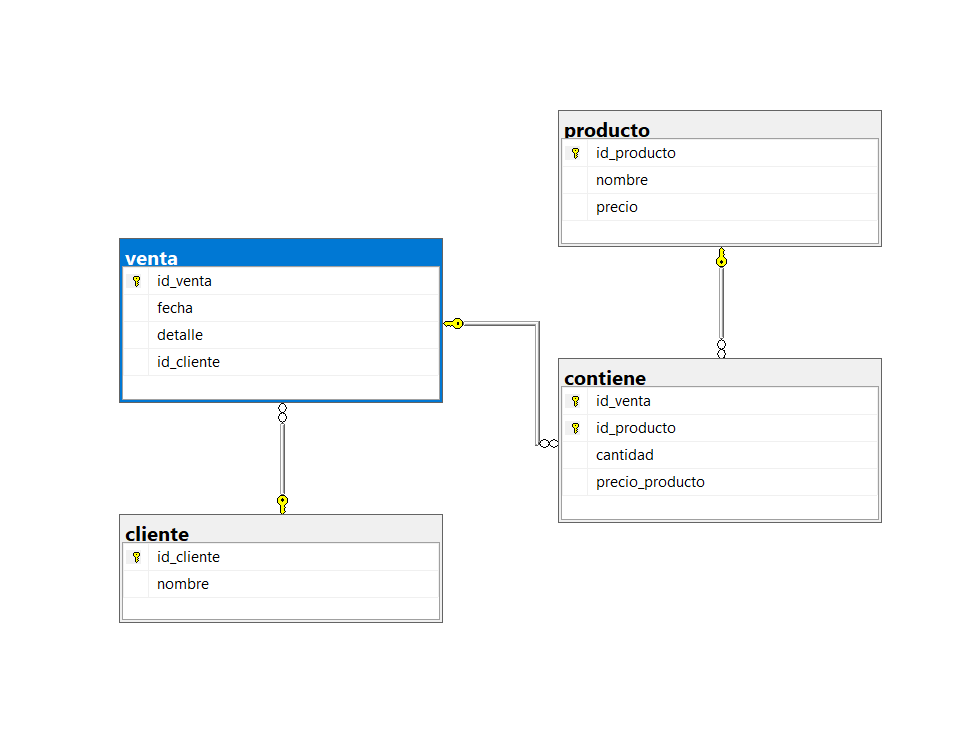

# Ejercicio 4: Cliente - Venta - Producto

## Vinculos

- Base de datos (SQL): [03-Construccion-basededatos/DB/04_cliente_venta_producto.sql](../DB/04_cliente_venta_producto.sql)
- Modelo relacional (.drawio): [02-Modelado-basededatos/ER-a R/Relacional/4R_Cliente_Venta_Producto.drawio](../../02-Modelado-basededatos/ER-a%20R/Relacional/4R_Cliente_Venta_Producto.drawio)
- Imagen del modelo: [02-Modelado-basededatos/ER-a R/Relacional/4.png](../../02-Modelado-basededatos/ER-a%20R/Relacional/4.png)
- Diagrama SQL (imagen): [03-Construccion-basededatos/img_diagramas_BD/04-cliente_venta_producto.png](../img_diagramas_BD/04-cliente_venta_producto.png)

## Vista de diagramas (para no confundirse)

### 1) Modelo relacional (diseno)


### 2) Diagrama SQL (implementacion en tablas)



## Descripcion del ejercicio

Una empresa mayorista necesita registrar clientes, pedidos y productos vendidos.

## Problematica

Cada venta debe pertenecer a un cliente y contener al menos un producto; ademas, se debe conservar cantidad y precio de venta por producto.

## Codigo SQL

```sql
-- CREAR BASE DE DATOS
IF DB_ID('sistema_ventas') IS NULL
BEGIN
    CREATE DATABASE sistema_ventas;
END
GO

-- UTILIZAR LA BASE DE DATOS
USE sistema_ventas;
GO

/*=========================== LIMPIAR TABLAS SI YA EXISTEN ==============================*/
IF OBJECT_ID('dbo.contiene', 'U') IS NOT NULL DROP TABLE dbo.contiene;
IF OBJECT_ID('dbo.venta', 'U') IS NOT NULL DROP TABLE dbo.venta;
IF OBJECT_ID('dbo.producto', 'U') IS NOT NULL DROP TABLE dbo.producto;
IF OBJECT_ID('dbo.cliente', 'U') IS NOT NULL DROP TABLE dbo.cliente;
GO

/*=========================== CREAR TABLA CLIENTE ==============================*/
CREATE TABLE dbo.cliente (
    id_cliente INT IDENTITY(1,1) NOT NULL,
    nombre VARCHAR(100) NOT NULL,
    CONSTRAINT pk_cliente PRIMARY KEY (id_cliente)
);
GO

/*=========================== CREAR TABLA PRODUCTO ==============================*/
CREATE TABLE dbo.producto (
    id_producto INT IDENTITY(1,1) NOT NULL,
    nombre VARCHAR(100) NOT NULL,
    precio DECIMAL(10,2) NOT NULL,
    CONSTRAINT pk_producto PRIMARY KEY (id_producto),
    CONSTRAINT ck_producto_precio CHECK (precio > 0)
);
GO

/*=========================== CREAR TABLA VENTA ==============================*/
CREATE TABLE dbo.venta (
    id_venta INT IDENTITY(1,1) NOT NULL,
    fecha DATE NOT NULL,
    detalle VARCHAR(200) NULL,
    id_cliente INT NOT NULL,
    CONSTRAINT pk_venta PRIMARY KEY (id_venta),
    CONSTRAINT fk_venta_cliente FOREIGN KEY (id_cliente)
        REFERENCES dbo.cliente (id_cliente)
);
GO

/*=========================== CREAR TABLA CONTIENE ==============================*/
CREATE TABLE dbo.contiene (
    id_venta INT NOT NULL,
    id_producto INT NOT NULL,
    cantidad INT NOT NULL,
    precio_producto DECIMAL(10,2) NOT NULL,
    CONSTRAINT pk_contiene PRIMARY KEY (id_venta, id_producto),
    CONSTRAINT ck_contiene_cantidad CHECK (cantidad > 0),
    CONSTRAINT fk_contiene_venta FOREIGN KEY (id_venta)
        REFERENCES dbo.venta (id_venta),
    CONSTRAINT fk_contiene_producto FOREIGN KEY (id_producto)
        REFERENCES dbo.producto (id_producto)
);
GO
```