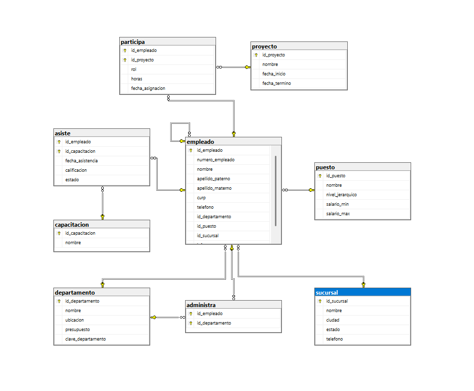

# Ejercicio 9: Empresa (Sucursales, Departamentos y Personal)

## Vinculos

- Base de datos (SQL): [03-Construccion-basededatos/DB/09_empresa.sql](../DB/09_empresa.sql)
- Diagrama SQL (imagen): [03-Construccion-basededatos/img_diagramas_BD/09-Empresa.png](../img_diagramas_BD/09-Empresa.png)
- Modelo relacional (.drawio): [02-Modelado-basededatos/ER-a R/Relacional/9R_Empresa.drawio](../../02-Modelado-basededatos/ER-a%20R/Relacional/9R_Empresa.drawio)
- Imagen del modelo: [02-Modelado-basededatos/ER-a R/Relacional/9.png](../../02-Modelado-basededatos/ER-a%20R/Relacional/9.png)

## Vista de diagramas (para no confundirse)

### 1) Modelo relacional (diseno)


### 2) Diagrama SQL (implementacion en tablas)



## Descripcion del ejercicio

Modelar y construir una base de datos empresarial que integra sucursales, departamentos, puestos, empleados, proyectos y capacitaciones.

## Problematica

La empresa necesita centralizar la gestion de su personal y su estructura organizacional, incluyendo jerarquia de jefes, participacion en proyectos, administracion de departamentos y asistencia a capacitaciones.

## Codigo SQL

```sql
CREATE DATABASE empresa;
USE empresa;

-- SUCURSAL
CREATE TABLE sucursal (
    id_sucursal INT AUTO_INCREMENT PRIMARY KEY,
    nombre VARCHAR(100),
    ciudad VARCHAR(100),
    estado VARCHAR(100),
    telefono VARCHAR(20)
);

-- DEPARTAMENTO
CREATE TABLE departamento (
    id_departamento INT AUTO_INCREMENT PRIMARY KEY,
    nombre VARCHAR(100),
    ubicacion VARCHAR(100),
    presupuesto DECIMAL(12,2),
    clave_departamento VARCHAR(20)
);

-- PUESTO
CREATE TABLE puesto (
    id_puesto INT AUTO_INCREMENT PRIMARY KEY,
    nombre VARCHAR(100),
    nivel_jerarquico VARCHAR(50),
    salario_min DECIMAL(10,2),
    salario_max DECIMAL(10,2)
);

-- PROYECTO
CREATE TABLE proyecto (
    id_proyecto INT AUTO_INCREMENT PRIMARY KEY,
    nombre VARCHAR(100),
    fecha_inicio DATE,
    fecha_termino DATE
);

-- CAPACITACION
CREATE TABLE capacitacion (
    id_capacitacion INT AUTO_INCREMENT PRIMARY KEY,
    nombre VARCHAR(100)
);

-- EMPLEADO
CREATE TABLE empleado (
    id_empleado INT AUTO_INCREMENT PRIMARY KEY,
    numero_empleado VARCHAR(20),
    nombre VARCHAR(50),
    apellido_paterno VARCHAR(50),
    apellido_materno VARCHAR(50),
    curp VARCHAR(18),
    telefono VARCHAR(20),

    id_departamento INT,
    id_puesto INT,
    id_sucursal INT,

    jefe INT,

    FOREIGN KEY (id_departamento)
        REFERENCES departamento(id_departamento),

    FOREIGN KEY (id_puesto)
        REFERENCES puesto(id_puesto),

    FOREIGN KEY (id_sucursal)
        REFERENCES sucursal(id_sucursal),

    FOREIGN KEY (jefe)
        REFERENCES empleado(id_empleado)
);

-- EMPLEADO ADMINISTRA DEPARTAMENTO
CREATE TABLE administra (
    id_empleado INT,
    id_departamento INT,
    PRIMARY KEY(id_empleado,id_departamento),
    FOREIGN KEY (id_empleado)
        REFERENCES empleado(id_empleado),
    FOREIGN KEY (id_departamento)
        REFERENCES departamento(id_departamento)
);

-- EMPLEADO PARTICIPA EN PROYECTO
CREATE TABLE participa (
    id_empleado INT,
    id_proyecto INT,
    rol VARCHAR(50),
    horas INT,
    fecha_asignacion DATE,
    PRIMARY KEY(id_empleado,id_proyecto),
    FOREIGN KEY (id_empleado)
        REFERENCES empleado(id_empleado),
    FOREIGN KEY (id_proyecto)
        REFERENCES proyecto(id_proyecto)
);

-- EMPLEADO ASISTE A CAPACITACION
CREATE TABLE asiste (
    id_empleado INT,
    id_capacitacion INT,
    fecha_asistencia DATE,
    calificacion DECIMAL(5,2),
    estado VARCHAR(30),
    PRIMARY KEY(id_empleado,id_capacitacion),
    FOREIGN KEY (id_empleado)
        REFERENCES empleado(id_empleado),
    FOREIGN KEY (id_capacitacion)
        REFERENCES capacitacion(id_capacitacion)
);
```
